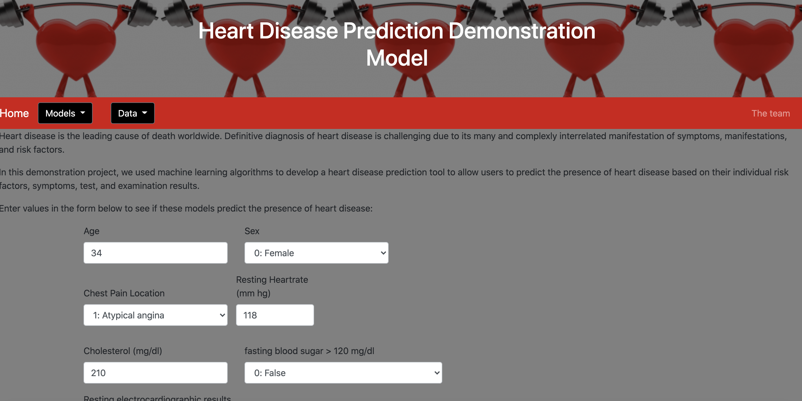
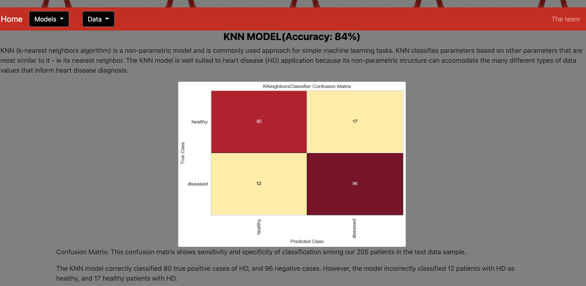
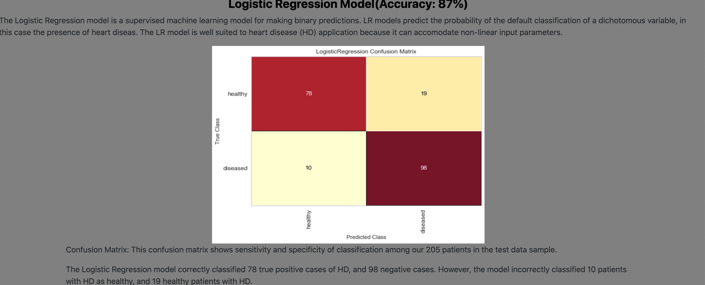

# UNC data analytics project

## Heart Disease Prediction

This app was created to demonstrate feasibility of using machine learning to build an on-line heart disease diagnosis predictor for patients to help guide referral to care for health care providers to provide decision support for diagnosis.

https://heart-disease-predictor-p3.herokuapp.com/home
